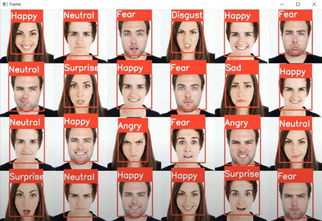

# Facial Expression Emotion Detection

## 📌 Overview
Facial Expression Emotion Detection is a Python-based deep learning project that can recognize human emotions through facial expressions in real-time video streams or static image inputs. This project uses a Convolutional Neural Network (CNN) trained on the FER-2013 dataset to detect and classify emotions such as **Angry**, **Disgust**, **Fear**, **Happy**, **Sad**, **Surprise**, and **Neutral**.

The model can:
- 🔴 Detect faces in images and video streams
- 😀 Classify emotions based on facial expressions
- 📷 Work with both static images and live webcam feeds

## 🧠 Features
- Real-time facial emotion detection via webcam
- Static image emotion classification
- Lightweight CNN model optimized for speed and accuracy
- Modular codebase for easy integration and extension
- Support for multiple faces in the frame simultaneously

## 🛠️ Technologies Used
- Python 3.x
- OpenCV
- TensorFlow / Keras
- NumPy
- Matplotlib

### 🧪 Data Augmentation
To improve generalization and combat overfitting, `ImageDataGenerator` is used for:
- Rescaling pixel values
- Random shear and zoom
- Horizontal flipping

### 🧱 Model Architecture
- 4 convolutional blocks with increasing filters: 32 → 64 → 128 → 256
- ReLU activation and max pooling
- Dropout layers to prevent overfitting
- Dense layer with 512 neurons
- Final softmax output layer with 7 units for emotion classification

### 🏋️ Training Details
- Loss function: `categorical_crossentropy`
- Optimizer: `Adam`
- Batch size: `32`
- Epochs: `30`
- Metrics: `accuracy`

## 🧪 Output
The system detects facial regions, classifies the emotion, and overlays the result on the video/image frame:

## 🔍 Model Architecture
The CNN model comprises multiple convolutional layers with ReLU activation, followed by max-pooling and dropout for regularization. The final dense layers produce emotion predictions through a softmax classifier. The model was trained using the FER-2013 dataset with ~30,000 annotated facial expression images.

## 📊 Emotion Labels
The following emotion classes are supported:
- Angry
- Disgust
- Fear
- Happy
- Sad
- Surprise
- Neutral

## 🙌 Acknowledgements
- [FER-2013 Dataset](https://www.kaggle.com/c/challenges-in-representation-learning-facial-expression-recognition-challenge/data)
- [OpenCV](https://opencv.org/)
- [Keras](https://keras.io/)
- [TensorFlow](https://www.tensorflow.org/)

---

